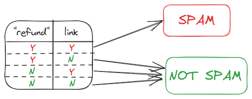

This is a group of machine learning algorithms which are used to classify data. It's key features are that it **assumes independence of predictors**, and gives **equal importance to each predictor**. 

It is based on Bayes theorem:

$$P(A|B) = \frac{P(B|A)P(A)}{P(B)}$$

Where A is the hypothesis and B is the predictors. For example, it might calculate the *probability of an email being spam (A)* given that the email *contains the text "refund" and it contains a link (B)*. There are no interactions considered such as if an email is more likely to contain a link if it contains "refund". Also, neither are considered stronger indicators of the email being spam, both are given equal importance.

This type of algorithm is very simple so has a **low run time**, and can be effective with a **small training dataset**. It is mainly used for **text classification** such as spam filtering or sentiment analysis. One of the main weaknesses of this type of algorithm is that real data is rarely independent which reduces performance of the classifier. Some of its other weaknesses include that it is not a good predictor so the probabilities given are not particularly accurate. It also cannot learn which are the most important features to make predictions.

